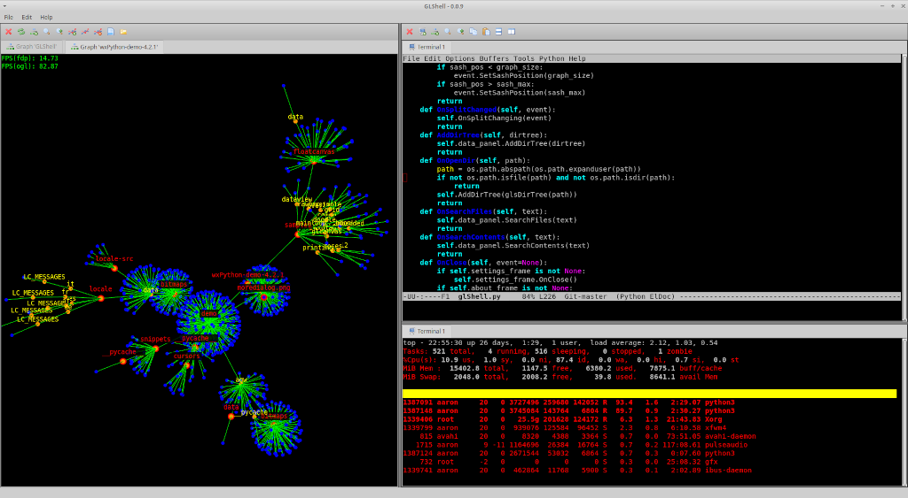

GLShell
============

``GLShell`` is a terminal emulator enhanced with OpenGL rendering.

It supports a number of visualization techniques including filesystem graph layout using force-directed placement and 2D/3D OpenGL rendering. The underlying terminal emulation is performed by Sivachandran's TermEmulator project (https://github.com/sivachandran/TermEmulator).

Run with: "cd GLShell && python3 glShell.py"

Development
===========

``GLShell`` source code and tracker are at https://github.com/avose/GLShell.
